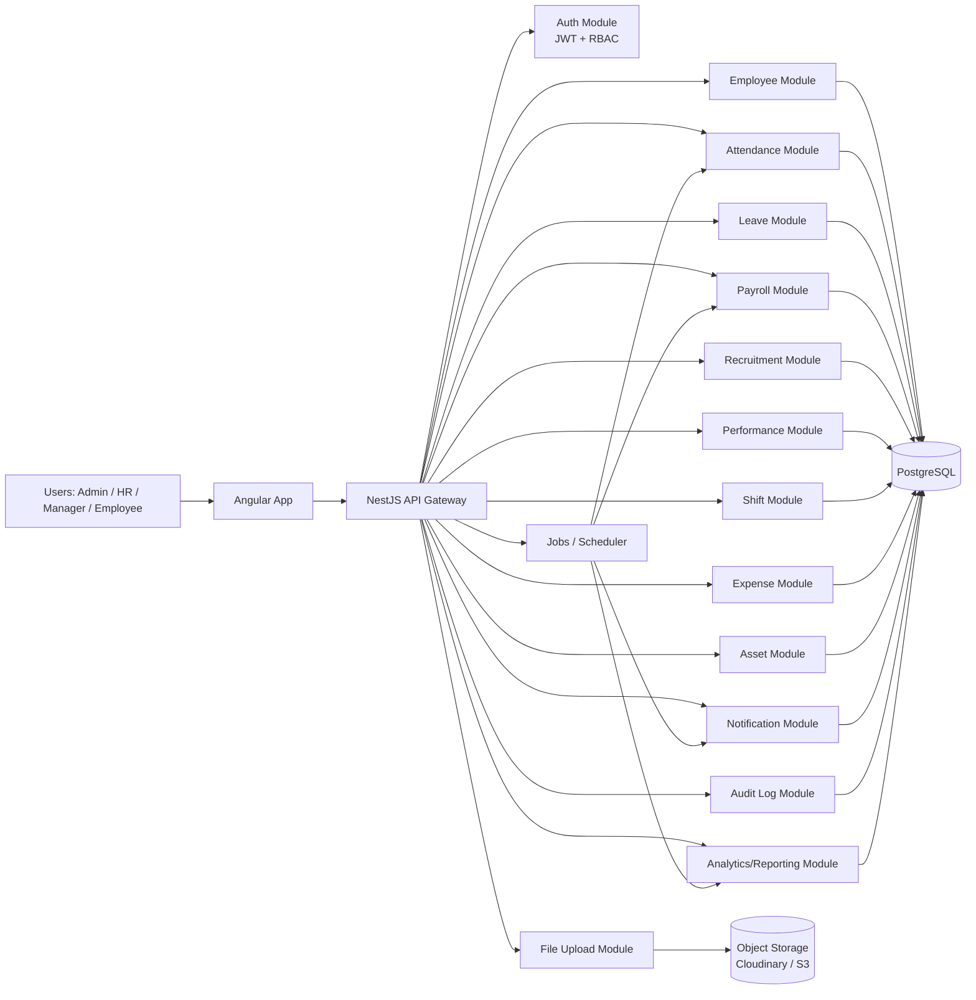
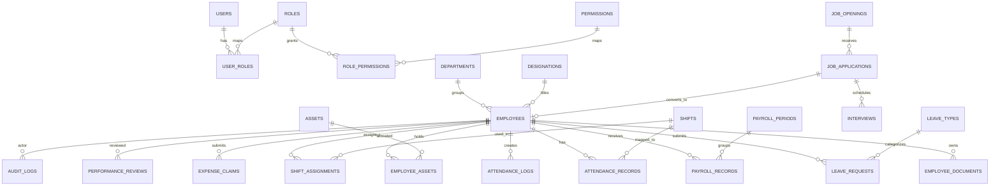

# E-HRMS Production Integration Blueprint

## Goal

Build a production-ready HRMS on top of the current Angular + NestJS + PostgreSQL codebase with feature coverage comparable to a modern HR platform:

- Employee Management
- Attendance and Check-in/Check-out
- Leave Management
- Payroll
- Recruitment
- Performance Management
- Shift and Scheduling
- Expense Claims
- Asset Management
- Notifications
- Document Uploads
- Audit Logs
- Dashboard Analytics

This blueprint is designed for the existing repository structure and deployment targets:

- Frontend: Vercel or Netlify
- Backend: Render
- Database: Render PostgreSQL

---

## Recommended Strategy

### Choose A: Rebuild the HR logic inside your own backend

Recommended approach: `A) Rebuild Frappe HR logic inside your backend`

Status in this repository: `Selected`

Why this is the better fit:

- You already have Angular + NestJS + PostgreSQL in place.
- You want your own product identity, not a visible dependency on another HR product.
- You need control over UI, database design, access control, workflows, and deployment.
- Direct sync with an external HR system adds long-term coupling, field-mapping complexity, version drift, and operational risk.

### When B is useful

Use `B) Connect directly to Frappe HR APIs` only if:

- a client already runs Frappe HR as the source of truth
- you need migration or temporary coexistence
- you are building an integration product rather than your own HRMS core

### Hybrid option

Best enterprise path:

- Core system of record in your own backend
- Optional import/sync adapters for external tools
- Internal normalized schema independent from any external vendor

---

## Reference Features From Official Frappe HR Docs

These are good reference workflows to match in your own product:

- Employee master and joining/exit details: https://docs.frappe.io/hr/employee
- Attendance and marking rules: https://docs.frappe.io/hr/attendance
- Check-in/out logs: https://docs.frappe.io/hr/employee-checkin
- Shift workflows: https://docs.frappe.io/hr/shift-management
- Auto-attendance flow: https://docs.frappe.io/hr/using-auto-attendance
- Payroll settings and working-day rules: https://docs.frappe.io/hr/payroll-settings

This blueprint mirrors those workflows but keeps your product branding and architecture independent.

---

## System Architecture



---

## Target Module Map

### 1. Employee Management

- Employee master
- department, designation, branch, grade
- joining details
- reporting manager
- emergency contacts
- bank details
- identity documents
- work history
- education history
- employee status lifecycle

### 2. Attendance

- employee check-in/out logs
- manual attendance marking
- bulk attendance tool
- monthly attendance views
- late entry / early exit
- attendance source: manual, biometric, import, auto
- auto-attendance derived from check-in logs + shifts

### 3. Leave

- leave types
- leave allocations
- leave policy
- holiday list
- leave requests
- approval workflow
- leave balances
- encashment support

### 4. Payroll

- salary structures
- salary components
- payroll periods
- salary slips
- deductions and reimbursements
- payroll based on attendance / leave
- net pay generation
- payroll approvals and payout status

### 5. Recruitment

- job requisitions
- job openings
- applicants
- interview rounds
- feedback
- offers
- hiring pipeline

### 6. Performance

- goals / KPIs
- review cycles
- appraisal templates
- manager reviews
- self reviews
- final ratings

### 7. Shift & Scheduling

- shift types
- shift assignments
- shift requests
- weekly rosters
- schedule exceptions
- auto attendance dependency

### 8. Expense Claims

- expense categories
- claims
- approval workflow
- reimbursement linkage to payroll / finance
- loans and salary advances

### 9. Asset Management

- asset catalog
- asset issue / return
- employee asset ledger
- maintenance / repair
- asset recovery at exit

### 10. Extra Platform Features

- notifications
- audit logs
- dashboards
- file/document uploads
- filters, exports, pagination

---

## Database Design

## Core ER Diagram



## Recommended Normalized Tables

### Identity and Access

- `users`
- `roles`
- `permissions`
- `user_roles`
- `role_permissions`

### People Core

- `departments`
- `designations`
- `employees`
- `employee_contacts`
- `employee_bank_accounts`
- `employee_documents`
- `employee_education`
- `employee_experience`

### Attendance

- `shift_types`
- `shift_assignments`
- `attendance_logs`
- `attendance_records`
- `attendance_exceptions`

### Leave

- `leave_types`
- `leave_policies`
- `leave_policy_assignments`
- `leave_allocations`
- `leave_requests`
- `holiday_lists`
- `holidays`

### Payroll

- `salary_components`
- `salary_structures`
- `salary_structure_components`
- `payroll_periods`
- `payroll_records`
- `payroll_adjustments`

### Recruitment

- `job_requisitions`
- `job_openings`
- `job_applications`
- `interviews`
- `interview_feedback`
- `job_offers`

### Performance

- `review_cycles`
- `goal_templates`
- `employee_goals`
- `performance_reviews`
- `performance_feedback`

### Expenses

- `expense_categories`
- `expense_claims`
- `expense_claim_items`
- `salary_advances`

### Assets

- `assets`
- `employee_assets`
- `asset_movements`
- `asset_maintenance`

### Platform

- `notifications`
- `audit_logs`
- `dashboard_snapshots`

---

## Example PostgreSQL Schema

```sql
create table departments (
  id uuid primary key default gen_random_uuid(),
  name varchar(120) not null unique,
  code varchar(30) unique,
  created_at timestamptz not null default now(),
  updated_at timestamptz not null default now()
);

create table designations (
  id uuid primary key default gen_random_uuid(),
  department_id uuid references departments(id) on delete set null,
  name varchar(120) not null,
  created_at timestamptz not null default now(),
  updated_at timestamptz not null default now()
);

create table employees (
  id uuid primary key default gen_random_uuid(),
  user_id uuid unique,
  employee_code varchar(30) not null unique,
  first_name varchar(100) not null,
  last_name varchar(100) not null,
  email varchar(180) not null unique,
  phone varchar(30),
  department_id uuid references departments(id) on delete set null,
  designation_id uuid references designations(id) on delete set null,
  reporting_manager_id uuid references employees(id) on delete set null,
  employment_type varchar(40) not null,
  status varchar(40) not null default 'ACTIVE',
  date_of_joining date not null,
  date_of_birth date,
  work_location varchar(40),
  attendance_device_id varchar(60),
  profile_photo_url text,
  created_at timestamptz not null default now(),
  updated_at timestamptz not null default now()
);

create table shift_types (
  id uuid primary key default gen_random_uuid(),
  name varchar(120) not null unique,
  start_time time not null,
  end_time time not null,
  checkin_grace_minutes int not null default 0,
  checkout_grace_minutes int not null default 0,
  auto_attendance_enabled boolean not null default false,
  created_at timestamptz not null default now(),
  updated_at timestamptz not null default now()
);

create table shift_assignments (
  id uuid primary key default gen_random_uuid(),
  employee_id uuid not null references employees(id) on delete cascade,
  shift_type_id uuid not null references shift_types(id) on delete restrict,
  start_date date not null,
  end_date date,
  status varchar(30) not null default 'ACTIVE',
  created_at timestamptz not null default now(),
  updated_at timestamptz not null default now()
);

create table attendance_logs (
  id uuid primary key default gen_random_uuid(),
  employee_id uuid not null references employees(id) on delete cascade,
  shift_type_id uuid references shift_types(id) on delete set null,
  log_type varchar(10) not null check (log_type in ('IN', 'OUT')),
  source varchar(30) not null default 'MANUAL',
  logged_at timestamptz not null,
  remarks text,
  created_at timestamptz not null default now()
);

create table attendance_records (
  id uuid primary key default gen_random_uuid(),
  employee_id uuid not null references employees(id) on delete cascade,
  shift_type_id uuid references shift_types(id) on delete set null,
  attendance_date date not null,
  status varchar(20) not null check (status in ('PRESENT', 'ABSENT', 'HALF_DAY', 'ON_LEAVE')),
  in_time timestamptz,
  out_time timestamptz,
  late_entry boolean not null default false,
  early_exit boolean not null default false,
  working_minutes int not null default 0,
  unique (employee_id, attendance_date)
);

create table leave_types (
  id uuid primary key default gen_random_uuid(),
  name varchar(100) not null unique,
  is_paid boolean not null default true,
  yearly_allocation numeric(10,2) not null default 0
);

create table leave_requests (
  id uuid primary key default gen_random_uuid(),
  employee_id uuid not null references employees(id) on delete cascade,
  leave_type_id uuid not null references leave_types(id) on delete restrict,
  from_date date not null,
  to_date date not null,
  total_days numeric(10,2) not null,
  reason text,
  status varchar(20) not null default 'PENDING',
  approver_id uuid references employees(id) on delete set null,
  created_at timestamptz not null default now(),
  updated_at timestamptz not null default now()
);

create table payroll_periods (
  id uuid primary key default gen_random_uuid(),
  name varchar(120) not null,
  month int not null,
  year int not null,
  start_date date not null,
  end_date date not null,
  status varchar(20) not null default 'OPEN'
);

create table payroll_records (
  id uuid primary key default gen_random_uuid(),
  employee_id uuid not null references employees(id) on delete cascade,
  payroll_period_id uuid not null references payroll_periods(id) on delete cascade,
  basic_salary numeric(12,2) not null default 0,
  allowances numeric(12,2) not null default 0,
  deductions numeric(12,2) not null default 0,
  net_salary numeric(12,2) not null default 0,
  payment_status varchar(20) not null default 'PENDING',
  generated_at timestamptz,
  paid_at timestamptz
);

create table job_openings (
  id uuid primary key default gen_random_uuid(),
  title varchar(180) not null,
  department_id uuid references departments(id) on delete set null,
  employment_type varchar(40) not null,
  openings int not null default 1,
  location varchar(120),
  status varchar(20) not null default 'OPEN',
  created_at timestamptz not null default now()
);

create table job_applications (
  id uuid primary key default gen_random_uuid(),
  job_opening_id uuid not null references job_openings(id) on delete cascade,
  full_name varchar(180) not null,
  email varchar(180) not null,
  phone varchar(30),
  resume_url text,
  source varchar(50),
  stage varchar(30) not null default 'APPLIED',
  score numeric(5,2),
  created_at timestamptz not null default now()
);
```

---

## Backend Module Structure

```text
backend/src/
  auth/
  access/
  users/
  employees/
    dto/
    entities/
    employees.controller.ts
    employees.service.ts
    employees.module.ts
  attendance/
    dto/
    entities/
    attendance.controller.ts
    attendance.service.ts
    attendance.module.ts
  leave/
  payroll/
  recruitment/
    dto/
    entities/
    recruitment.controller.ts
    recruitment.service.ts
    recruitment.module.ts
  performance/
  shifts/
  expenses/
  assets/
  notifications/
  audit/
  dashboard/
  files/
  reports/
  common/
    decorators/
    guards/
    interceptors/
    pipes/
    enums/
```

## NestJS API Design

### Authentication

- `POST /api/auth/login`
- `POST /api/auth/register`
- `POST /api/auth/refresh`
- `GET /api/auth/me`

### Employees

- `GET /api/employees`
- `GET /api/employees/:id`
- `POST /api/employees`
- `PATCH /api/employees/:id`
- `DELETE /api/employees/:id`
- `POST /api/employees/:id/documents`
- `GET /api/employees/:id/assets`

### Attendance

- `GET /api/attendance`
- `GET /api/attendance/:id`
- `POST /api/attendance`
- `PATCH /api/attendance/:id`
- `POST /api/attendance/checkins`
- `GET /api/attendance/checkins`
- `POST /api/attendance/bulk-mark`
- `POST /api/attendance/auto-process`
- `GET /api/attendance/reports/monthly`

### Leave

- `GET /api/leave`
- `POST /api/leave`
- `PATCH /api/leave/:id/approve`
- `PATCH /api/leave/:id/reject`
- `GET /api/leave/balances/:employeeId`

### Payroll

- `GET /api/payroll`
- `POST /api/payroll/generate`
- `GET /api/payroll/slips/:employeeId`
- `PATCH /api/payroll/:id/pay`
- `GET /api/payroll/periods`

### Recruitment

- `GET /api/recruitment/openings`
- `POST /api/recruitment/openings`
- `GET /api/recruitment/applications`
- `POST /api/recruitment/applications`
- `PATCH /api/recruitment/applications/:id/stage`
- `POST /api/recruitment/interviews`
- `POST /api/recruitment/offers`

### Performance

- `GET /api/performance/reviews`
- `POST /api/performance/goals`
- `POST /api/performance/reviews`
- `PATCH /api/performance/reviews/:id/finalize`

### Shifts

- `GET /api/shifts/types`
- `POST /api/shifts/types`
- `GET /api/shifts/assignments`
- `POST /api/shifts/assignments`
- `POST /api/shifts/requests`
- `PATCH /api/shifts/requests/:id/approve`

### Expenses

- `GET /api/expenses/claims`
- `POST /api/expenses/claims`
- `PATCH /api/expenses/claims/:id/approve`
- `PATCH /api/expenses/claims/:id/reject`
- `GET /api/expenses/advances`

### Assets

- `GET /api/assets`
- `POST /api/assets`
- `POST /api/assets/issue`
- `POST /api/assets/return`
- `GET /api/assets/employee/:employeeId`

### Notifications / Audit / Reports

- `GET /api/notifications`
- `PATCH /api/notifications/:id/read`
- `GET /api/audit`
- `GET /api/reports/dashboard`
- `GET /api/reports/attendance`
- `GET /api/reports/payroll`
- `GET /api/reports/recruitment`

---

## RBAC Design

### Roles

- `ADMIN`
- `HR`
- `MANAGER`
- `EMPLOYEE`

### Example Permission Model

- `employee.read`
- `employee.write`
- `attendance.mark`
- `attendance.approve`
- `leave.approve`
- `payroll.generate`
- `recruitment.manage`
- `performance.review`
- `asset.issue`
- `audit.read`

### Access Examples

- Admin: full system access
- HR: all HR modules except system settings
- Manager: team attendance, leave approvals, performance reviews
- Employee: self-service profile, attendance, leave, payslips, expenses, assets

---

## Angular Frontend Structure

```text
src/app/
  core/
    guards/
    interceptors/
    models/
    services/
      auth.service.ts
      employee.service.ts
      attendance.service.ts
      leave.service.ts
      payroll.service.ts
      recruitment.service.ts
      performance.service.ts
      shift.service.ts
      expense.service.ts
      asset.service.ts
      dashboard.service.ts
      notification.service.ts
  shared/
    components/
    ui/
    pipes/
    utils/
  features/
    dashboard/
    auth/
    employees/
      list/
      detail/
      form/
      documents/
      assets/
    attendance/
      checkins/
      records/
      monthly-report/
      bulk-mark/
    leave/
      requests/
      balances/
      approvals/
    payroll/
      periods/
      salary-slips/
      adjustments/
    recruitment/
      openings/
      applications/
      interviews/
      offers/
    performance/
      goals/
      reviews/
    shifts/
      types/
      assignments/
      requests/
    expenses/
      claims/
      advances/
    assets/
      catalog/
      issue-return/
      employee-assets/
    reports/
    account-settings/
```

---

## UI/UX Standards

### Dashboard

- attendance summary cards
- leave approval queue
- payroll status cards
- hiring funnel chart
- employee growth chart
- upcoming birthdays / anniversaries
- notifications panel

### Tables

- server-side pagination
- filters
- sortable columns
- export CSV / Excel
- status chips
- empty-state handling

### Charts

- line chart for attendance trend
- bar chart for payroll cost by month
- donut chart for leave distribution
- funnel chart for recruitment stages

### Responsive Design

- desktop sidebar + content layout
- mobile collapsible navigation
- cards stack on smaller screens
- horizontal scroll only for dense tables

---

## Data Synchronization Design

### CRUD Rules

- all writes go through backend
- Angular uses API services only
- no frontend-only business source of truth

### Real-Time Strategy

Recommended:

- start with request/response + polling for dashboard widgets
- add WebSocket or SSE later for:
  - notifications
  - attendance check-ins
  - live approval updates

### Validation

- NestJS DTO validation using `class-validator`
- DB constraints for uniqueness and status enums
- transaction boundaries for payroll generation, approvals, asset issue/return

---

## Step-by-Step Integration Plan

### Phase 1. Foundation

1. Normalize current employee, attendance, leave, payroll entities.
2. Add migration support instead of relying only on `synchronize`.
3. Finalize RBAC role and permission model.
4. Centralize DTO validation and error handling.

### Phase 2. People Core

1. Expand employee schema with department/designation/manager/document relations.
2. Add file upload pipeline for employee documents.
3. Add audit logging on create/update/delete.

### Phase 3. Attendance + Shifts

1. Create `shift_types`, `shift_assignments`, `attendance_logs`, `attendance_records`.
2. Implement check-in/out endpoints.
3. Add monthly attendance generation and late/early rules.
4. Add auto-attendance scheduler.

### Phase 4. Leave

1. Add leave type, leave allocation, leave request, holiday list tables.
2. Add approval workflows.
3. Integrate balances into dashboard and employee self-service.

### Phase 5. Payroll

1. Add salary structure and payroll period tables.
2. Generate payroll from employee salary + attendance/leave data.
3. Create salary slips and payout statuses.

### Phase 6. Recruitment

1. Add openings, applications, interviews, offers.
2. Create applicant stage transitions.
3. Connect hired applicant to employee onboarding.

### Phase 7. Performance

1. Add goal tracking and review cycles.
2. Add self/manager review forms.
3. Add final ratings and analytics.

### Phase 8. Expenses + Assets

1. Build claim submission and approval workflow.
2. Add reimbursement status and payroll linkage.
3. Add asset issue/return and exit recovery flow.

### Phase 9. Reporting + Notifications

1. Add analytics endpoints with aggregate SQL queries.
2. Add in-app notifications.
3. Add email notifications for approvals, onboarding, payroll release.

### Phase 10. Deployment Hardening

1. Add environment-based config.
2. Secure file uploads and secrets.
3. Enable logging, health checks, and backup strategy.

---

## Sample Code Pattern: Employee + Attendance

## NestJS Attendance Entity

```ts
@Entity('attendance_logs')
export class AttendanceLog {
  @PrimaryGeneratedColumn('uuid')
  id: string;

  @ManyToOne(() => Employee, { nullable: false, onDelete: 'CASCADE' })
  employee: Employee;

  @ManyToOne(() => ShiftType, { nullable: true, onDelete: 'SET NULL' })
  shiftType?: ShiftType | null;

  @Column({ type: 'varchar', length: 10 })
  logType: 'IN' | 'OUT';

  @Column({ type: 'varchar', length: 30, default: 'MANUAL' })
  source: 'MANUAL' | 'DEVICE' | 'IMPORT' | 'AUTO';

  @Column({ type: 'timestamptz' })
  loggedAt: Date;

  @CreateDateColumn()
  createdAt: Date;
}
```

## NestJS Attendance DTO

```ts
export class CreateAttendanceLogDto {
  @IsUUID()
  employeeId: string;

  @IsOptional()
  @IsUUID()
  shiftTypeId?: string;

  @IsIn(['IN', 'OUT'])
  logType: 'IN' | 'OUT';

  @IsDateString()
  loggedAt: string;
}
```

## NestJS Attendance Controller

```ts
@Controller('attendance/checkins')
@UseGuards(JwtAuthGuard, RolesGuard)
export class AttendanceController {
  constructor(private readonly attendanceService: AttendanceService) {}

  @Post()
  @Roles('ADMIN', 'HR', 'EMPLOYEE')
  create(@Body() dto: CreateAttendanceLogDto, @Request() req: any) {
    return this.attendanceService.createLog(dto, req.user);
  }

  @Get()
  @Roles('ADMIN', 'HR', 'MANAGER')
  findAll(@Query() query: AttendanceQueryDto) {
    return this.attendanceService.findLogs(query);
  }
}
```

## NestJS Attendance Service Pattern

```ts
async createLog(dto: CreateAttendanceLogDto, actor: AuthUser) {
  const employee = await this.employeeRepo.findOneByOrFail({ id: dto.employeeId });

  const log = this.logRepo.create({
    employee,
    logType: dto.logType,
    loggedAt: new Date(dto.loggedAt),
    source: 'MANUAL',
  });

  const saved = await this.logRepo.save(log);
  await this.auditService.record({
    actorUserId: actor.id,
    entityType: 'ATTENDANCE_LOG',
    entityId: saved.id,
    action: 'CREATE',
  });

  return saved;
}
```

## Angular Attendance Service Pattern

```ts
@Injectable({ providedIn: 'root' })
export class AttendanceService {
  private http = inject(HttpClient);

  getLogs(params: any) {
    return this.http.get<PaginatedResponse<AttendanceLog>>('/api/attendance/checkins', { params });
  }

  createLog(payload: CreateAttendanceLogRequest) {
    return this.http.post<AttendanceLog>('/api/attendance/checkins', payload);
  }
}
```

## Angular Employee Detail Example

```ts
loadEmployeeProfile(employeeId: string) {
  forkJoin({
    employee: this.employeeService.getById(employeeId),
    attendance: this.attendanceService.getLogs({ employeeId, page: 1, pageSize: 10 }),
    leaveBalance: this.leaveService.getBalances(employeeId),
    assets: this.assetService.getByEmployee(employeeId),
  }).subscribe(({ employee, attendance, leaveBalance, assets }) => {
    this.employee.set(employee);
    this.attendance.set(attendance.items);
    this.leaveBalance.set(leaveBalance);
    this.assets.set(assets);
  });
}
```

---

## Deployment Configuration

## Frontend

- Build command: `npm run build`
- Output: `dist/e-hrms/browser`
- Environment variable:
  - `API_BASE_URL=https://your-backend.onrender.com/api`

## Backend

- Build command: `cd backend && npm run build`
- Start command: `node dist/main.js`
- Environment variables:
  - `PORT`
  - `DATABASE_URL`
  - `JWT_SECRET`
  - `JWT_EXPIRATION`
  - `DB_SSL=true`
  - `DB_SSL_REJECT_UNAUTHORIZED=false`
  - `STORAGE_BUCKET`
  - `STORAGE_ACCESS_KEY`
  - `STORAGE_SECRET_KEY`
  - `MAIL_HOST`
  - `MAIL_PORT`
  - `MAIL_USER`
  - `MAIL_PASS`

## Database

- Render PostgreSQL
- daily backups
- separate staging and production databases

---

## Production Hardening Checklist

- use migrations
- use DTO validation everywhere
- add API rate limiting for auth endpoints
- add refresh token rotation
- encrypt sensitive employee identifiers if required
- use object storage for documents, not database blobs
- add audit logs to every mutation
- add health check endpoint
- add structured logging
- add job queue for payroll generation and notifications

---

## What To Build Next In This Repo

### Immediate next implementation order

1. Normalize current employee entity and add related tables.
2. Replace current attendance module with:
   - attendance logs
   - attendance records
   - shift assignments
3. Build recruitment module with real entities instead of snapshot-only workspace data.
4. Build expense and asset modules with actual CRUD entities.
5. Add migrations and production config.

### Important note

The current repository has some core HR modules and a newly added operations hub, but it does not yet have full normalized, production-grade parity across every HR workflow. This blueprint is the target design for getting there in a maintainable way.
